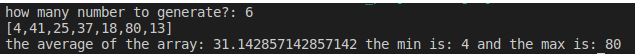

# Exercise 4.4 algo-js
## Simple statistics program

this program is a simple **statistics** program for an array of random generated numbers, that can output the average the mininmum and maximum of a givin array.



### This code uses five functions.

1. ```rand100()``` it's function to generate random numbers from 1 to 100. using  ```Math.floor()``` and ```Math.rendom()``` to do the job and it have no argument.

```
function rand100(){
return Math.floor(Math.random() * 100) + 1;  
}
```

2. ```multiRand(n)``` is a function that uses the ```rand100()``` to populate an array by preforming a for loop from the user inputed value ```n``` that is the argument of the function.

```
function multiRand(n){
    for (i=0; i<=n;i++){
        randomArray.push(rand100());
    }
}
```

3. ```average(arr)``` is a function to calculeite the **average** of an givin array using the formula the sum of values devided by the it's total number of elements.

```
function average(arr){
    let avr = 0;
    for (i=0; i<arr.length; i++){
        avr += arr[i];
    }
    avr = avr/arr.length;
    return avr;
}
```

4. ```min(arr)``` it's a function that uses ```Math.min()``` to output the **minimum** value in an array.

```
function min(arr){
    return Math.min(...arr);
}
```

5. ```max(arr)``` it's a function as the previous one uses ```Math.max()``` to output the **maximum** value in an array.

```
function max(arr){
    return Math.max(...arr);
}
```

this an exercise 4.4 on functions in javascript.

by Mohamed shmayssany E-mail : m.shmayssany@gmail.com .

Becode.org